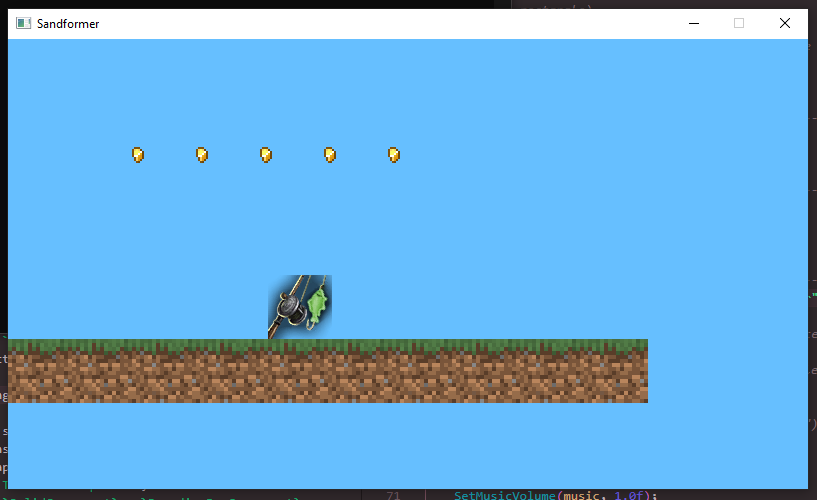

A C++ 2D block platformer game built as a custom ECS case study, using [raylib](https://www.raylib.com/).



**The current exciting end-user features:**

- Moving around and jumping
- Collecting coins
- Solid ground

**The more exciting technical features:**

- Custom entity component system, using:
    - Pure-data struct-based components, no inheritance nor virtual calls, only variants for discriminators (see `Components.hpp`)
    - Multiple *systems* with separation of concerns, operating on entities with the relevant components
    - Event bus pattern for communicating systems (within `World.cpp`)
    - Cached "views" into entities with specific component combinations for faster (and readable) query/iteration within systems, using variadic templates (`EntityView` class)

`World` is the class that manages the ECS state, owning the entities, systems, and event queue. Its `Update()` method (called from the raylib boilerplate main loop) drives the game logic and rendering by calling each system's `Update()` and `Render()` methods, and processing events emitted by systems.

Currently the following systems exist:

- **WorldGenSystem**: creates the ground blocks and coins
- **PhysicsSystem**: applies gravity to entities with `PhysicsComponent` and handles collisions
- **PlayerSystem**: handles movement/jump controls on the player entity
- **RenderSystem**: draws entities with `TextureComponent` and caches loaded textures
- **CurrencySystem**: handles the coin pickup mechanics, using a `CurrencyComponent` and `InventoryComponent` (on player entity)

The main game loop code is based on the raylib game template: https://github.com/raysan5/raylib-game-template

## Controls

Keyboard:
 - A/D: move left/right
 - W: jump; hold to jump higher

## Building

As per the raylib game template, 2 build systems are setup:

- Visual Studio 2022
- CMake (preferred)

The following building instructions are copied from the template's readme.

### Linux
When setting up this template on linux for the first time, install the dependencies from this page:
([Working on GNU Linux](https://github.com/raysan5/raylib/wiki/Working-on-GNU-Linux))

You can use this templates in a few ways: using Visual Studio, using CMake, or make your own build setup. This repository comes with Visual Studio and CMake already set up.

Chose one of the follow setup options that fit in you development environment.

### Visual Studio

- After extracting the zip, the parent folder `raylib-game-template` should exist in the same directory as `raylib` itself.  So, your file structure should look like this:
    - Some parent directory
        - `raylib`
            - the contents of https://github.com/raysan5/raylib
        - `raylib-game-template`
            - this `README.md` and all other raylib-game-template files
- If using Visual Studio, open projects/VS2022/raylib-game-template.sln
- Select on `raylib_game` in the solution explorer, then in the toolbar at the top, click `Project` > `Set as Startup Project`
- Now you're all set up!  Click `Local Windows Debugger` with the green play arrow and the project will run.

### CMake

- Extract the zip of this project
- Type the follow command:

```sh
cmake -S . -B build
```

> if you want to configure your project to build with debug symbols, use the flag `-DCMAKE_BUILD_TYPE=Debug`

- After CMake configures your project, build with:

```sh
cmake --build build
```

- Inside the build folder is another folder (named the same as the project name on CMakeLists.txt) with the executable and resources folder.
- cmake will automatically download a current release of raylib but if you want to use your local version you can pass `-DFETCHCONTENT_SOURCE_DIR_RAYLIB=<dir_with_raylib>` 

## License

This game source code is licensed under an unmodified zlib/libpng license, which is an OSI-certified, BSD-like license that allows static linking with closed source software. Check [LICENSE](LICENSE) for further details.
